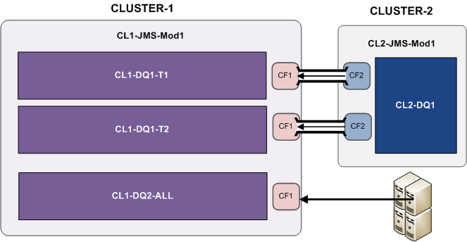
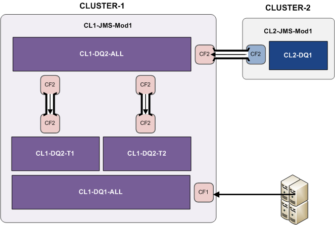

Java Messaging Service
----------------


Connection Factory
""""""""""""""""""""""""""""

Description
```````````````````

A connection factory object is an administration object available under a JMS Module. A connection factory is used to access to queues or topics configured into this module.
The connection factory is handling connections and is accessed by consumers and providers by its JNDI name.

Configuration
```````````````````

Load Balance
~~~~~~~~~~~~~~~~~~~

- Load Balancing Enabled: When enabled this load balance producers between JMS servers. All messages sent by producers will be dispatched between JMS servers even messages issued during a single connection. Note this option will not dispatch consumers between JMS servers.
- Server Affinity Enabled: this option handles producers AND consumers connections. When enabled producers or consumers will send or get messages from the same JMS server. Hence if Load Balancing Enabled option and Server Affinity Enabled option are both enabled the producer will send all its messages to the same JMS server during the connection. The next connection it will send all messages to another JMS server.


Distributed Queue
""""""""""""""""""""""""""""

Description
```````````````````

Distributed queue is a queue deployed to multiple JMS servers. As this queue is distributed some options can be configured to handle connection and messages in the cluster.

If a consumer is connected to a JMS server which has no message in its queue all others members of the cluster will forward messages to this JMS server.

Real life
""""""""""""""""""""""""""""

As explain above consumers are not load balanced by the connection factory. If the consumer is deployed on the same server as the queue hence the connection factory will direct this consumer to the current server queue. 

Below the example of Kyko application

Kyko application
```````````````````

Kyko application has two WebLogic cluster and each cluster has four WebLogic server.

First architecture
~~~~~~~~~~~~~~~~~~~

In the first architecture of our application the architect designed a single queue in the cluster 2 where all messages types have been stored. Bridges from cluster 1 selected their messages according to types and put them into the associated queue.

Two major issues were encountered with this architecture:

- Bridge consumers were not dispatched smoothly : some consumers of type T1 were connected twice on a WebLogic server and some others servers haven't any consumer. Therefore some messages stored in some queues were not retrieve by cluster 1
- Repetitive disconnection : as bridge selected some messages into the remote queue, it reaches often the maximum idle time as no message were fetched. 



Second architecture
~~~~~~~~~~~~~~~~~~~

In the second architecture we have created a new distributed queue into cluster 1 to fix the problem of bridge disconnection but unfortunately the other issue remained.

The connection factory CF1 was configure with the Load balance enabled and server affinity disabled. We disabled the server affinity to avoid to receive all messages on the same JMS server for the queue CL1-DQ1-ALL.


Last architecture
~~~~~~~~~~~~~~~~~~~

In the last architecture we have created a new connection factory CF2 with the server affinity enabled to force bridges to connect to their own JMS server.


