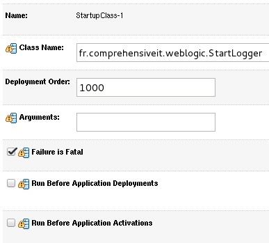

Startup WebLogic
----------------

Admin server
~~~~~~~~~~~~~~~

Managed server
~~~~~~~~~~~~~~~

Depending on your configuration, managed servers can take time to startup. 
WebLogic deploys its application after two phases.

- Phase 1: The application has the "prepare" status. At this step WebLogic controls package integrity and ensure the application can be deployed. We can meet errors at this step if a package has been corrupted while transferring from the Admin server to managed servers.
- Phase 2: The application has the "active" status. WebLogic deploys the application in all managed servers of the cluster.

Real life:
On a WebLogic 12c platform we corrupted our WAR application in different ways. You can find below results of theses tests

+-----------------------------------+-------------------+-----------------------+
| Test description                  | Deployment status | Application available |
+===================================+===================+=======================+
| Delete plan.xml                   | Active            | Yes                   |
+-----------------------------------+-------------------+-----------------------+
| Delete web.xml                    | Active            | Yes                   |
+-----------------------------------+-------------------+-----------------------+
| Delete weblogic.xml               | Active            | Yes                   |
+-----------------------------------+-------------------+-----------------------+
| Corrupt war file with dd command  | Active            | No                    |
+-----------------------------------+-------------------+-----------------------+

Startup and Shutdown Classes
""""""""""""""""""""""""""""
Startup classes and shutdown classes are loaded when the server bootup. Depending on the deployment order the class can be deployed before or after other deployments and services.

StartLogger example
```````````````````

In this example we developed a class named DatabaseLogger which writes the current date into t_start and a class named StartServlet which calss DatabaseLogger.
When configuring a startup class in WebLogic console, the managed server will try to call the method main into this class.
If we do not write this method main the following error will occur during startup:

.. code-block:: java

  java.lang.NoSuchMethodException: app.StartServlet does not define 'public static void main(String[])'

To configure a class into startup we first need to add the package to classloader.
A quick and dirty solution is to add lines below to setDomainEnv.sh

.. code-block:: shell

  CLASSPATH="${CLASSPATH}:/opt/wls12210/user_projects/domains/DOMAIN-2/upload/StartLoggerProject.jar
  export CLASSPATH

Then you can add the class to start to Weblogic configuration with the following steps:
- Environment / Startup and Shutdown Classes
- Click New / select Startup Class
- Add Startup name to display in WebLogic console and startup class name to boot
- Select target and press finish

For our example we set the following configuration



If startup class failed to load server will shutdown. This is not the default value but can be usefull to know at the begining your application is not able to initialize
CacheRetriever example
``````````````````````
In this example we are showing how startup class can be used.
We developed a servlet which requires quite lot of informations from database and store it to cache before displaying result to user.
This servlet will take time at the first run as cache is not initialized.
Then we developed a jar that we initialize cache at the bootup. Hence when servlet is called the cache is initialized already.
